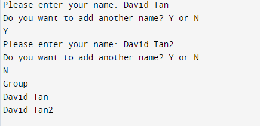

# Title: Group Generator Project
### This is a python program that can be used to generate groups of people after inputting the names of all the people grouping up.

## How to install:
1. Clone the repository: https://github.com/skytruong90/Group_Gen-Python.git
2. The main code is inside a folder called group.py when you download everything.
3. Run the project with a Pycharm IDE.

## What I have learned: 
1. How to hold a list of names within Python.
2. Generate the size of that list.
3. Practice coding with Python coding structure.

## Sceenshot:

